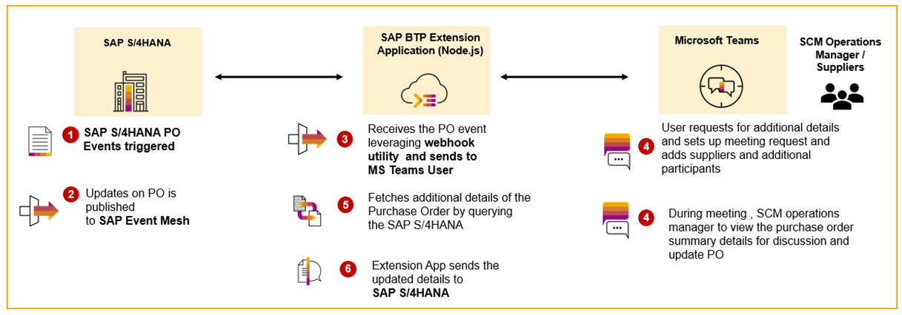
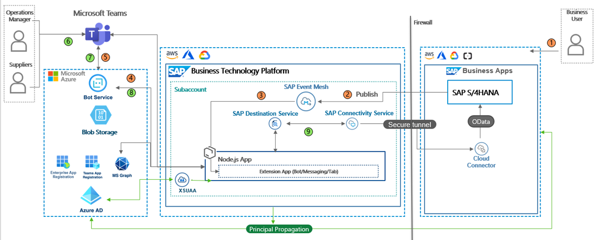
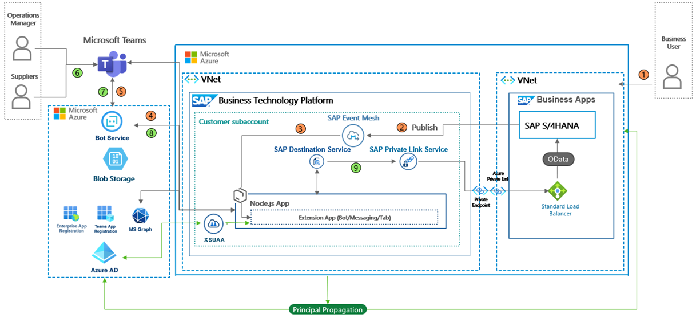

# Create Supplier Collaboration by extending SAP S/4HANA into Microsoft Azure Ecosystem.

# Description:
This repository contains code samples and instructions for developing a native Microsoft Teams application and SAP BTP Extension application for extending SAP S/4HANA Business scenarios into Microsoft Azure ecosystem.

Important: Please be aware that this GitHub repository will be updated with additional scenarios.Make sure you are pulling the repository from time to time and do a redeployment to SAP Business Technology Platform.

# Scenario:
This is one of the use-case in Procure-To-Pay process.
Requestor creates a Purchase Order with required line items. The operations Manager / Purchase Manger needs to receive the same for approval and look for closure of the PO. In case of delays, Operations Manager will interact with suppliers to discuss the updates on pending confirmations /delivery overdue on the list of line items. This will help all the stakeholders to discuss, view the purchase order details together and complete the confirmation summary.

# Business Process Flow 
The target application will provide the SAP Business User to be able to perform ERP operations via MS Teams. Below depicts the business process flow.

Let us look at the user journey of the Requestor and Purchasing/Operations manager persona. 
1. The requestor creates/updates a purchase order in SAP S/4HANA with a list of line items for a specific supplier. 
2. For every update on a purchase order , events are published to SAP Event Mesh.
3. These events are sent to SCM Operations Manager, who is MS Teams Users. The user receives the alerts on updates on Purchase Order.
4. Operations Manager can request for further PO details before deciding on discussion with Supplier.
5. Business user decides to setup meeting with supplier to discuss and receive confirmation on unfullfilled POs.
6. During the meeting , SCM Operation Manager can retrieve additional information on current confirmation summary and update back to SAP S/4HANA.

# Solution Architecture

# Solution Architecture for SAP S/4HANA on-premise using Cloud Connector and SAP BTP Connectivity Service

The architecture below leverages the Cloud Connector and SAP Connectivity Service to establish secured communication between SAP BTP and SAP S/4HANA seamlessly. We will see how the communication and flow of information work. Principal propagation of the users is enabled using XSUAA. Let us quickly understand how communication happens among the different systems and approaches for the principal propagation of users.

1 – When a user signs into MS Teams and starts the bot, the bot handler (part of the extension application running on SAP BTP) is called and asks the Microsoft Teams client to obtain an authentication token for the current user by sending a so-called OAuthCard to the client.

2 – The Microsoft Teams client fulfils this request and obtains a bot application token from Azure Active Directory using the session of the current Microsoft Teams user. This process might require an initial login on the first usage of the extension application, including a potential consent for scopes or a Multi-Factor authentication (MFA).

3 – If the current session can be used to obtain a valid token from Azure Active Directory, this bot application token is sent to the Microsoft Teams client, which sends it back to the bot handler of your extension application. Depending on the data required, this token can now be exchanged for an application access token, including scopes for Microsoft Graph or a custom scope allowing you to obtain a SAML Assertion for SAP BTP access (more details will be provided later!).

4 – In the case of SAP BTP access, the extension application/bot handler exchanges the application access token for a SAML Assertion containing the user's attributes and unique identifier. The so-called On-Behalf-Of (OBO) flow (click here) is used for this step. Obtaining a valid SAML Assertion is based on a trust configuration between SAP BTP and your Azure Active Directory.

5 – The SAML Assertion is sent to the SAP BTP authorization server (XSUAA) to receive an access token for the SAP BTP environment. This token request needs to contain a valid Client Id and Secret, which is taken from a service key of the XSUAA Instance. This process of exchanging a SAML Assertion provided by one platform for a valid token of another platform follows the RFC 7522 standard (click here).

6 – Using the access token received by XSUAA in exchange for the SAML Assertion, the extension application/bot handler can now call the OData Services from SAP S/4HANA with the propagated user identity.

7 – The OData services are executed, and the result is sent to the extension application. The OData requests are secured by a standardized OAuth2 SAML Bearer Assertion, allowing the required Principal Propagation on the last mile.

Note: Principal propagation configurations can be set up, which is optional. For testing purposes, you can proceed if you want to execute the scenario with Basic Authentication. However, this is not recommended.

# Solution Architecture for SAP S/4HANA on Azure using Private Link Service in SAP BTP and Microsoft Azure.

The architecture below leveraging the SAP Private Link Service in SAP BTP and Azure Private Link for connectivity helps seamlessly establish secured communication between SAP BTP and SAP S/4HANA.

Please look for detailed documentation in the tutorials folder - [Azure-Private-Cloud-PrivateLink](./tutorial/Private-Link-Service/README.md) in case you want to setup as per this architecture. You will also need to perform all the steps mentioned in the Implementation Section. Note: Principal propagation configurations should be set up, which is not optional. We will be updating the codebase to support Basic Authentication for testing purposes; however, this is not recommended.

# Requirements

Below are the technical prerequistics for a successful Microsoft Teams - SAP S/4HANA integration. Primarily, we will need SAP S/4HANA configured for Purchase Orders, SAP Business Technology Platform and Microsoft Azure. Below is the list of configurations and services required to implement the end-to-end business flow.

**SAP S/4HANA On-Premise**
- 2 business users ( 1st  for the requestor, 2nd for the approver) 

**SAP Business Technology Platform Services**
- Cloud Foundry Subaccount
    > - Foundation for running the MS Teams extension application.
    > - Required for Azure AD - SAP BTP trust
- Memory/Runtime quota
    > - Required to host the MS Teams extension application
- Authorization & Trust Management Service
    > - Secure MS Teams extension application endpoints

**Microsoft Azure and Microsoft Teams Subscription**
- A valid Azure subscription
- An Azure Active Directory
    > - Required for Azure AD - SAP BTP trust
    > - Microsoft user and authorization management
    > - Contains user profile information (email, names, pictures)
    > - Application registrations to allow Graph API and SAP BTP access

- Microsoft Graph API
    > - Used to retrieve user profile information and MS Teams data (chat members, team members also.)

- An Azure Bot Service
    > - Services for Azure bots (e.g. Application Insights)
    > - Bot connection between extension app and Microsoft Teams

- An Azure Storage Account
    > - Storing of Conversation References for notifications

- A MS Teams subscription
    > - Required for paid services like Azure Storage Account

**MISC**

- SAP BTP - Azure AD trust
    > - A trust between SAP BTP and Azure AD (vice versa) has to be established

- Admin users in all landscapes
    > - The implementation requires admin users in all landscapes (SAP BTP, Microsoft Azure)

- Mapping based on an email address
    > - The users in both systems(Microsoft Azure and SAP S/4HANA) need to have the same email address for principal propogation.

Let us get started with development!

## Implementation : Configuration and Development

Follow the below steps to configure SAP S/4HANA, SAP BTP and Azure System for the scenario. Based on the installation type of SAP S/4HANA, please follow the documentation for configurations related to connectivity in SAP BTP. 

## [Step 1: Configuration in SAP Business Technology Platform](./tutorial/Step1-Configure-SAP-BTP/README.md)

## [Step 2: Configuration in Microsoft Azure Platform and MS Teams Applications](./tutorial/Step2-Configure-Azure/README.md)

## [Step 3: Configuration in SAP S/4HANA System](./tutorial/Step3-Configure-S4HANA/README.md)

## [Step 4: Configuration of Principal Propogation and SAP Cloud Connector](./tutorial/Step4-Configure-Cloud-Connector/README.md)

## [Step 5: Deployment of Extension Application](./tutorial/Step5-Deploy-Extension-Application/README.md)

## [Step 6: Test E2E Application](./tutorial/Step6-Testing-the-Application/README.md)

Please follow the below steps to configure additional settings needed for SAP S/4HANA running on Azure and SAP BTP on Azure(any region)
## [Setup and Deployment for SAP S/4HANA on Azure leveraging Private Link Service ](./tutorial/Private-Link-Service/README.md)

## Additional Resources

This project has been implemented based on the following Microsoft Bot Builder and Microsoft Office Developer sample repositories.

https://github.com/microsoft/BotBuilder-Samples/tree/main/samples/typescript_nodejs/13.core-bot/
https://github.com/OfficeDev/Microsoft-Teams-Samples/tree/main/samples/app-sso/nodejs/

Another source of inspiration is the following blog post series by Martin Raepple, in which a Microsoft Teams extension for SAP S/4HANA is developed.

https://blogs.sap.com/2020/07/17/principal-propagation-in-a-multi-cloud-solution-between-microsoft-azure-and-sap-cloud-platform-scp/ 
https://blogs.sap.com/2020/10/01/principal-propagation-in-a-multi-cloud-solution-between-microsoft-azure-and-sap-cloud-platform-scp-part-ii/
        

## Known Issues

Below are some known issues and updates that need to be considered during implementation. There will be updates to the repository and updates for the below. Please do pull the latest version and redeploy the application to SAP BTP.

Mobile device optimization
    The adaptive cards are not yet optimized for picture-perfect mobile rendering. Whereas the functionality is given, the appearance of the mobile interface could be improved. This could be another challenge when optimizing the extension app for your personal needs.

User and admin consent
    User and a potential admin consent have not been in scope for this application. Please ensure you're granting admin consent in Azure Active Directory for the application registration to prevent potential consent issues when calling APIs.

## Useful links

### Build apps for Microsoft Teams
- [Documentation](https://docs.microsoft.com/en-us/microsoftteams/platform/overview)
- [Code samples](https://github.com/OfficeDev/Microsoft-Teams-Samples)

### Microsoft Graph API
- [Documentation](https://docs.microsoft.com/en-us/graph/)

### Bot Framework
- [Documentation](https://docs.microsoft.com/en-us/azure/bot-service/index-bf-sdk)
- [Send proactive notifications to users](https://docs.microsoft.com/en-us/azure/bot-service/bot-builder-howto-proactive-message)
- [Write directly to storage](https://docs.microsoft.com/en-us/azure/bot-service/bot-builder-howto-v4-storage)
- [Save user and conversation data](https://docs.microsoft.com/en-us/azure/bot-service/bot-builder-howto-v4-state)
- [Code samples](https://github.com/microsoft/BotBuilder-Samples)

### Adaptive Cards
- [https://adaptivecards.io/](https://adaptivecards.io/)
- [Designer](https://adaptivecards.io/designer/)

## Disclaimer
This project has been a PoC, including several limitations and prerequisites. The objective was to build a Microsoft Teams extension for an existing SAP S/4HANA system. For this reason, the coding should not be seen as any recommendation for productive implementation. It fulfils the purpose and requirements of a PoC scope and is not intended for productive usage! It has been declared as pure PoC only to give potential development teams some first ideas for solving potential challenges when integrating Microsoft Teams and SAP S/4HANA using the SAP Business Technology Platform. We do not recommend using any parts of this coding within a productive implementation without further review or validation!

## How to obtain support
[Create an issue](https://github.com/SAP-samples/<repository-name>/issues) in this repository if you find a bug or have questions about the content.
 For additional support, [ask a question in SAP Community](https://answers.sap.com/questions/ask.html).

## Code of Conduct
Refer to [CODE OF CONDUCT](CODE_OF_CONDUCT.md) file.

## Contributing
Refer to [CONTRIBUTING](CONTRIBUTING.md) file for guidelines to contributions from external parties.

## License
Copyright (c) 2022 SAP SE or an SAP affiliate company. All rights reserved. This project is licensed under the Apache Software License, version 2.0, except as noted otherwise in the [LICENSE](LICENSE) file.
