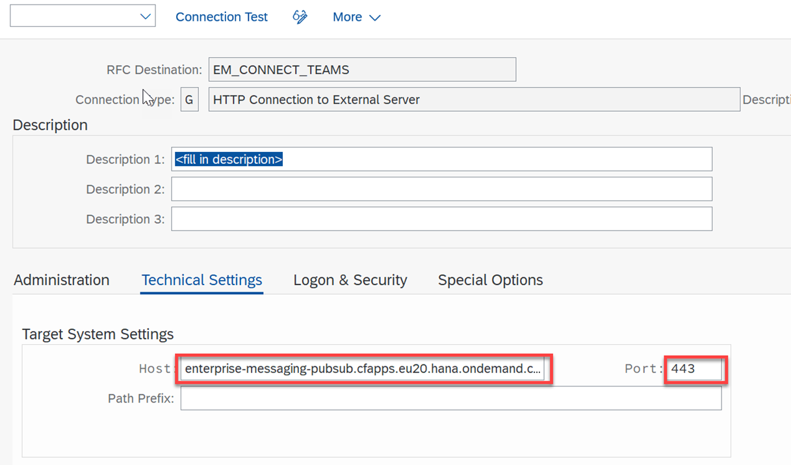
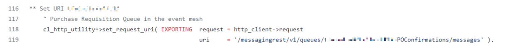
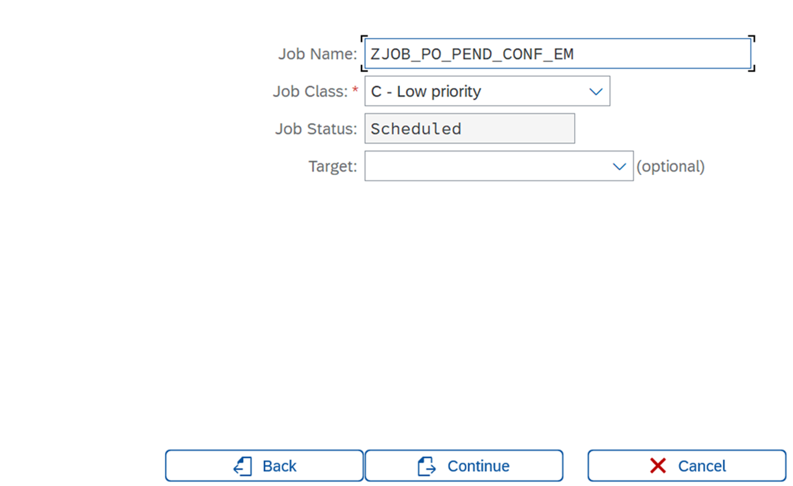

## Configure SAP S/4HANA for business scenario
In this section, you will create an OData service based on the SAP RAP framework to read, create, update & delete the purchase order supplier confirmations. You will also create a background job that will read all the pending supplier confirmations for purchase orders and sends them from SAP S/4HANA to SAP Event Mesh.

### Prerequisites
Basic knowledge of SAP ABAP, RAP framework, navigating through SAP, assigning user roles & authorizations in your SAP S/4HANA system.

### 1. Create a Service Key for the SAP Event Mesh Service Instance

In this step, you will create a service key for the SAP Event Mesh service instance. This service key holds the OAuth client credentials and the REST service URL to communicate with the SAP Event Mesh service.

1. Go to the SAP BTP cockpit, navigate to your subaccount and choose **Services** > **Instances and Subscriptions**.

    

2. In the **Event Mesh** service instance line, choose the three dots and then choose **Create Service Key**..

    

3. Provide a name and choose **Create**.

    

4. Choose **View** to open the service key.

    

5. Scroll down to the **httprest** protocol and copy the values of the **clientid**, **clientsecret**, **tokenendpoint** and **uri** parameters. You will need these parameters later on.

    

### 2. Create and Maintain the RFC Destination
You will create a destination to maintain the REST URL of the SAP Event Mesh to connect and send messages.

1. In your SAP S/4HANA system, open the **SM59** transaction and choose the **Create** icon to create a new destination.

    

2. In the **Destination** field, enter a unique name for the destination and select **G HTTP Connection to external server** from the **Connection Type** dropdown menu.

    

3. Go to the **Technical Settings** tab. In the **Host** field, enter the copied value of the **uri** parameter in step 5 of the **1. Create a Service Key for the SAP Event Mesh Service Instance** section without **https://**. In the **Port** field, enter **443**.

    

    >Note: Host should not have **https** while pasting in the **uri**

4. Go to the **Logon & Security** tab and in the **Status of Secure Protocol** section, select the **Active** radio button. Then, select **ANONYM SSL  Client(Anonymous)** from the **SSL Certificate** dropdown menu. Choose **Save**..
    
    

5. Choose **Connection Test** to check if the connection to SAP Event Mesh is established successfully.
    
    

    The result should look like this:
    

   
### 3. Configure the OAuth profile 
You will configure the OAuth client, which will be used by the RFC destination that you created in step 2 of the **4. Create an RFC Destination in SAP S/4HANA** section.

1. In your SAP S/4HANA system, open the **OA2C_CONFIG** transaction. This will open a web application in your browser. Choose **Create** to create an OAuth client.
    
    

2. In the **Create a new OAuth 2.0 client** pop-up:

    - Select **/IWXBE/MGW_MQTT** from the **OAuth 2.0 Client Profile** dropdown menu. 
    - In the **Configuration Name**  field, enter a unique name for the OAuth client.
    - In the **OAuth 2.0 Client ID** field, enter the copied value of the **clientid** parameter in step 5 of the  value from **1. Create a Service Key for the SAP Event Mesh Service Instance** section.
    
    

3. Go to the **Administration** tab and in the **General Settings**, in the **Client Secret** field, enter the copied value of the **clientsecret** parameter in step 5 of the  value from **1. Create a Service Key for the SAP Event Mesh Service Instance** section

4. In the **Authorization Server Settings** section, in the **Authorization endpoint** and **Token Endpoint** field, enter the copied value of the **tokenendpoint** parameter in step 5 of the **1. Create a Service Key for the SAP Event Mesh Service Instance** section. In the value, remove /token and add **/authorize** instead.
    
    For example,customlogicaa-54uuyxjv.authentication.eu12.hana.ondemand.com/oauth/authorize.
    
    

5. Scroll down to the **Access Settings** section and select the **Form Fields**, **Header Field** and **Client Credentials** radio buttons.
    
    

6. Choose **Save**.

    

### 4. Import the ABAP Git Project
Use the GitHub [ABAP Branch URL ](https://github.com/SAP-samples/btp-msteams-s4-suppliercollab/tree/abap) to import the ABAP package, which has the code for the RAP OData service and the background job.

1. In your SAP S/4HANA system, open **SE38** transaction and run the program **ZABAPGIT_STANDALONE**.
    >Note: If this program is not available in the system, follow the [Install ABAP Git](https://docs.abapgit.org/guide-install.html) documentation

2. Choose **New Online** to import the repository.
    
    

3. In the **GitHub Repository URL** field, enter "https://github.com/SAP-samples/btp-msteams-s4-suppliercollab". In the **Package** field, enter your choice of package name and in the **Branch** field, enter **abap**. Choose **Create Online Repo** to import the repository.

    

4. Choose **Clone Online Repo** and then choose **pull** to save the repository to your SAP S/4HANA system.
    >Note: For more information, follow the official [ABAP Git tutorial](https://docs.abapgit.org/guide-online-install.html)

### 5. Understanding the generated artifacts & code

Now that you have imported the code, let's understand how it works in detail.
>Note: You should use eclipse with ABAP plugins installed to do the next steps.

After importing the abapGit project, a new CDS view, report, class, behaviour definition & service binding will be generated in the system.

The CDS view **ZI_PO_CONF** is used to fetch all the supplier confirmations for Purchase Orders.

The behaviour definition **ZI_PO_CONF** provides the OData service's Create, Update & Delete capabilities. We are using unmanaged save, to call a function module to save the supplier confirmations.

The class **zbp_i_po_conf** is linked to the behavior definition and has the code to handle the create, update & delete operations. Navigate to **Local Types** to see the code.

The method **save_modified** is added to handle the create, update & delete operations. In this method, we use the function module **ME_PO_CONFIRM** to update the supplier confirmations.

The **ZPEND_SUPPL_CONF_EMSEND_JOB** report will run and execute the **RUN_EM_JOB** method from the **ZCL_PENDING_SUPPL_CONIF_EMSEND** class. This will be used to fetch all the pending supplier confirmations and send them to SAP Event Mesh service.

Inside the **RUN_EM_JOB** method, the **GET_PENDING_SUPPL_CONF_POS** private method will be called to fetch all the all the purchase orders with pending supplier confirmation. 

>Note: Here we are using the standard CDS view that returns all the pending supplier confirmation summary.

After the execution of the **GET_PENDING_SUPPL_CONF_POS** method, the **CONNECT_TO_EM** method will create the HTTP connection instance to SAP Event Mesh, which is explained using the comments in the code.

The **SEND_SUPPL_CONF_PO_TO_EM** method will send the purchase orders with pending supplier confirmation summary to SAP Event Mesh.

### 6. Adjust the Code of the ABAP Application

1. Form the URI value to update it in the **CONNECT_TO_EM** method. This URI depends on wheather you are using a trail or enterprise account in SAP BTP.

    - In case of a trial account, use SAP Event Mesh with the **default** plan. Then, the URI value would look like this: **/messagingrest/v1/queues/PRApproval/messages** where **PRApproval** is your queue name.

    - In case of an enterprise account, use SAP Event Mesh with the **standard plan**. Then, the URI value would look like this: **/messagingrest/v1/queues/orgname%2Fs4%2Ft1%2FPRApproval/messages** where **orgname/s4/t1** is the namespace of the SAP Event Mesh service instance and **PRApproval** is the queue name.

        **Note**: The URI value should always have encoded the fully-qualified queue name.
        For example, if the fully-qualified queue name is **orgname/s4/t1/PRApproval**, then the encoded fully-qualified queue name will be **orgname%2Fs4%2Ft1%2FPRApproval**.

2. In your SAP S/4HANA system, open the **SE24** transaction and in the **Object Type** field, enter **ZCL_PENDING_SUPPL_CONIF_EMSEND** and choose **Change**.

3. Open the **CONNECT_TO_EM** method to update the URI value as formed in step 1.

    

4. Open the **CONSTRUCTOR** method to update the destination, OAuth profile and OAuth configuration parameters.
    
    - Replace the value for **dest_name** with the value of the destination name from step 2 of the **4. Create an RFC Destination in SAP S/4HANA** section.
    - Replace the value for **auth_profile** with the value of the OAuth 2.0 client profile from step 2 of the **5. Configure The OAuth Profile** section.
    - Replace the value for **auth_conf** with the value of the configuration name from step 2 of the **5. Configure The OAuth Profile** section.

    Your configuration should look like this:
    

5. Save and activate the class.

6. In eclipse, open the service binding **ZSB_PO_CONF** and choose **Publish** to activate it.
    

Now you have the service which will be used in the upcoming chapters to read, create, update & delete the supplier confirmations from the extension application deployed in SAP BTP.

### 7. Create Background Job to send the Workflow Instances to the SAP Event Mesh
You will configure the **ZPEND_SUPPL_CONF_EMSEND_JOB** report to run in the background every day. This sends the the purchase orders with pending supplier confirmations to the SAP Event Mesh.

1. In your SAP S/4HANA system, open the **SM36** transaction and choose **Job Wizard** to create a new background job.
    
    

2. Choose **Continue**.
    
    

3. In the **Job Name** field, enter a unique name and choose **Continue**.
    
    

4. Select the **ABAP Program Step** radio button and then choose **Continue**.
    
    

5. In the **ABAP Program Name** field, enter **ZPEND_SUPPL_CONF_EMSEND_JOB** and choose **Continue**.
    
    

6. Choose **Continue**.
    
    

7. Select the **Date/time** radio button and choose **Continue**.
    
    

8. Select the **Period** check box and enter the start date & time(morning 8 or the time you prefer to run this backgroundjob everyday).
    
    

9. Now select the **Daily** radio button to the run this job on a daily basis and choose **Continue**.
    
    

10. Choose **Complete** to schedule the background job.
    
    

YYou have now created of the background job that will send all the purchase orders with pending supplier confirmations every day in the morning.

