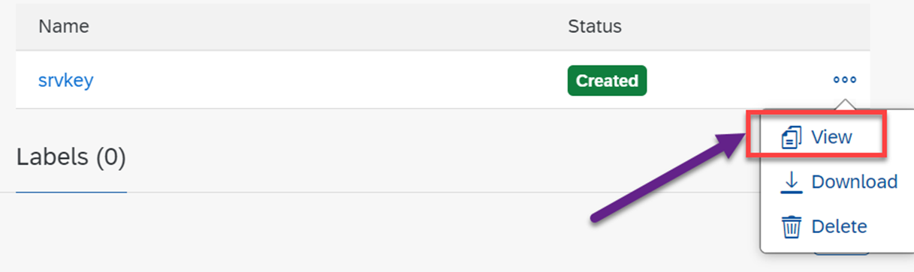
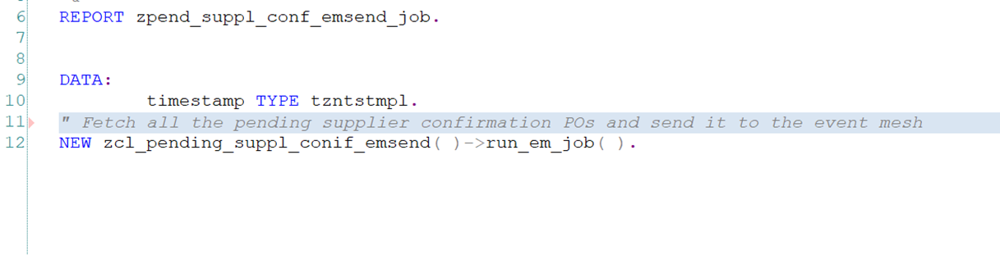
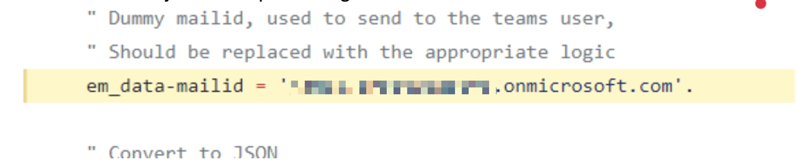
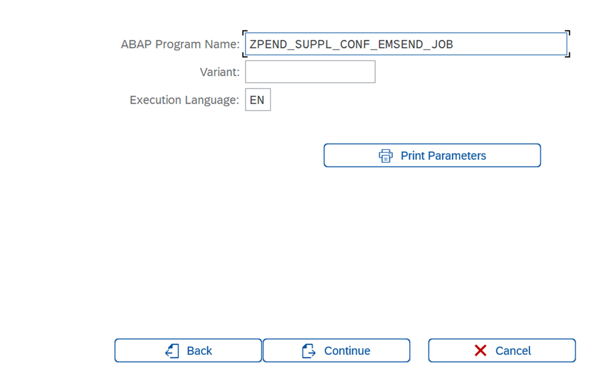
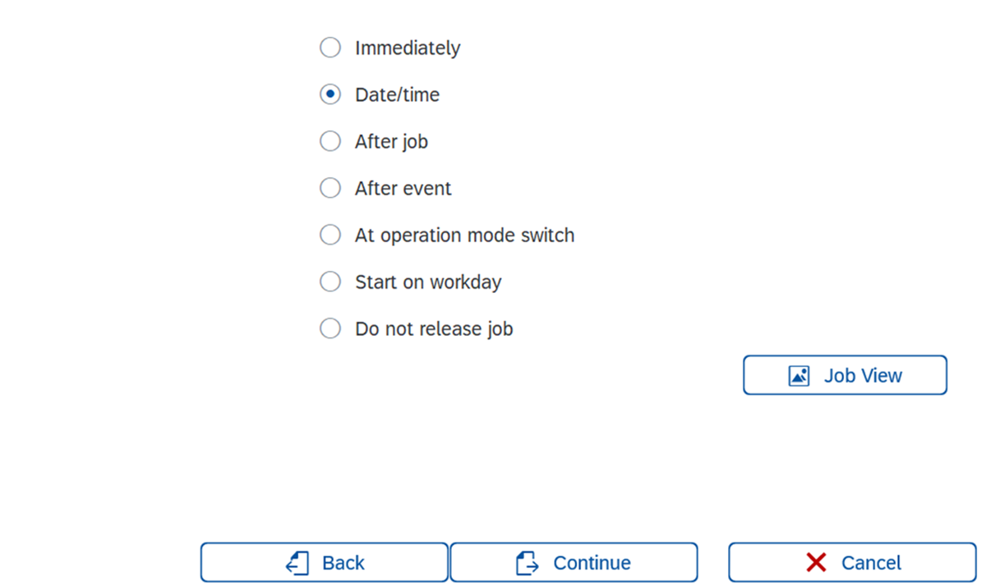

## Configure SAP S/4HANA for business scenario
In this section, you will create an OData service based on the SAP RAP framework to read, create, update & delete the purchase order supplier confirmations and create a background job. This background job will read all the pending supplier confirmations for purchase orders and send them as events from SAP S/4HANA to SAP Event Mesh.

### Prerequisites
Moderate knowledge of SAP ABAP, RAP framework, assigning user roles, navigating through SAP & developer authorizations assigned to your SAP S/4HANA user id.

### Create SAP RAP based OData service for Purchase Order Supplier Confirmation
You will create(import the git repo) an OData service using the RAP framework for reading, creating, updating & deleting the confirmation summary for purchase orders.

>Note: This OData Service is custom development as there is no standard OData service available at the time of this git repository creation for SAP S/4HANA 2020

### 1. Import ABAP Git Project to run
Use the GitHub [ABAP Branch URL ](https://github.com/SAP-samples/btp-msteams-s4-suppliercollab/tree/abap) to import the ABAP package, which has the code for the RAP OData service and the background job (which will be discussed in the upcoming steps).

1.1  Open **SE38** and execute the program **ZABAPGIT_STANDALONE**. 
    >Note: If the above program is not there in the system, use the below link to install ABAP Git 
    [abapGit Documentation](https://docs.abapgit.org/guide-install.html)

1.2  Click the **New Online** button to import the repository. 

1.3 Enter the git repository URL, package & branch as **ABAP** and click **Create Online Repo** to import the repository. 

1.4 Select **Clone Online Repo** and click **pull** to save the repo to your SAP S/4HANA system. 
    >Note: For more information, please follow the official ABAP Git tutorial below: 
    [abapGit Documentation](https://docs.abapgit.org/guide-install.html)

### 2. Understanding the generated artifacts & code

 After installing the git repository, different artifacts will be created in your package like the CDS view, behavior definitions, service bindings, etc.; let's understand them in detail.
    >Note: You should use eclipse with ABAP plugins installed to do the next steps.

2.1 Open the CDS view **ZI_PO_CONF** in eclipse, which is used to fetch all the supplier confirmations for Purchase Orders.

2.2 **ZI_PO_CONF** is the behavior definition that provides the service's Create, Update & Delete capabilities. We are using unmanaged save, to call a function module to save the supplier confirmations.

2.3 The class **zbp_i_po_conf** is linked to the behavior definition and has the code to handle the create, update & delete (CUD) operations. Navigate to the **Local Types** to find the code.

2.4 **save_modified** method is overrided to handle the CUD operations. In this method, we call the function module **ME_PO_CONFIRM** to save the supplier confirmations.

    >Note: Use this function module with caution as this is not a released function module

2.5 Now activate the service by clicking the **Publish** button.

Now you have the service which will be used in the upcoming chapters to read, create, update & delete the supplier confirmations from the extension application deployed in SAP BTP.

### 3. Generate SAP Event Mesh Service Key

In this section, you will create a service key for your SAP Event Mesh instance, which has the OAuth client credentials and the rest service URL to communicate with the SAP Event Mesh.

3.1. Go to your SAP BTP subaccount and select **Instances and Subscriptions**. 

3.2. Click the **Three dot Button** to open the menu and click **Create Service Key** to create the service key. 

3.3. Provide a name and click **Create** to create the service key. 

3.4. Click **View** to open the **Service Key**. 

3.5.. Scroll down to the **httprest** protocol and note the **clientid**, **clientsecret, **tokenendpoint**, and uri**, which you will use in the upcoming steps. 

### 4. Create and Maintain the RFC Destination
In this section, you will create a RFC destination to maintain the rest URL of the SAP Event Mesh to connect and send messages.

4.1. Goto **SM59** transaction and click **create** icon as shown in the below screenshot to create a new destination. 

4.2. Provide a unique name for the destination and select the **Connection Type** as **G HTTP Connection to external server**. 

4.3. Copy the **URI** from **Step 14** and paste it in **Host** input box and use **443** as the port. 

    >Note: Host should not have **https** while pasting in the **uri**

4.4. Select the **Active** radio button for **SSL** in the section **Logon & Security** and **SSL Client(Anonymous)** in **SSL Certificate** and click **Save**. 

4.5. Click **Connection Test** to check if the connection to Event Mesh is established successfully. 

   
### 5.Configure the OAuth profile 
In this section, you will configure the OAuth client, which will be used by the destination from **Step 16** to connect to Event Mesh. 

5.1. Open transaction **OA2C_CONFIG**, which will open a web application in your browser, and click **Create** to create an OAuth client. 

5.2. Select the drop down value **/IWXBE/MGW_MQTT** in the field **OAuth 2.0 Client Profile**, enter a unique name in the **Configuration Name** and **OAuth 2.0 Client ID** value from **Step 14** : **Clientid**. 

5.3. Scroll down and update the values for **Client Secret**  from **Step 14** **clientsecret** field as well as enter **Authorization Endpoint**  and **Token Endpoint**   from **Step 14** **tokenendpoint** field  

5.4. Select the radio buttons **Form Fields**, **Header Field** and **Client Credentials** as shown in the screenshot. 

5.5. **Save** it. 

### 6. Understand and Update the Background Job Codebase

When you have imported the ABAP code from git, the background job is also imported to your SAP S/4HANA system. So let's understand how the code works.

6.1. After completing the **Step 4**, you will have a report **ZPEND_SUPPL_CONF_EMSEND_JOB** and a class **ZCL_PENDING_SUPPL_CONIF_EMSEND** created in your SAP S/4HANA system. 

6.2. Report: **ZPEND_SUPPL_CONF_EMSEND_JOB** will run and execute the class **ZCL_PENDING_SUPPL_CONIF_EMSEND** method **RUN_EM_JOB**. This method will fetch & send all the purchase orders with pending supplier confirmaitons( called from the background job, which is described in the upcoming steps). 

6.3. Inside the method: **RUN_EM_JOB**, the private method: **GET_PENDING_SUPPL_CONF_POS** will be called to fetch all the purchase orders with pending supplier confirmation summary. 

    >Note: Here we are using the standard CDS view that returns all the pending supplier confirmation summary.

6.4. After the execution of the method: **GET_PENDING_SUPPL_CONF_POS**, the method: **CONNECT_TO_EM** will create the HTTP connection instance to the SAP Event Mesh, which is well explained using the comments in the code. 

You will have to update the queue name in the URI(With NameSpace) in the **CONNECT_TO_EM** method. 
**Note :** The name space should be modified to match the one provided in the em instance. 
Save and activate the object below proceeding: 

6.5 The **SEND_SUPPL_CONF_PO_TO_EM** method will send the purchase orders with pending supplier confirmation summary to the SAP Event Mesh. Make sure you update the emailId of the test user in the same method as shown below. 

    >**Note**: Also make sure that the emailId assigned to the User in the On-premise system is same as the test user in Azure. 

    >**Note**: The Destination, OAuth Profile & OAuth Configuration are maintained in the **Contructor** method.

### 7. Create Background Job to send the Workflow Instances to the SAP Event Mesh

In this step, you will create the background job to send the purchase orders with pending supplier confirmations to the SAP Event Mesh. After this step, the SAP Event Mesh subscription will forward them to the MS Teams application for the action.

Automate the report from **Step 6.2** to run in the background every day morning to send all the purchase orders with pending supplier confirmations to the SAP Event Mesh.

7.1 Open the Transaction **SM36** and click **Job Wizard** to create a new background job. 

7.2. Click **Continue**. 

7.3. Enter a unique name in **Job Name** input box and click **Continue**. 

7.4. Select **ABAP Program Step** and click **Continue**. 

7.5. Enter the report name from **Step 6.2** and click **Continue**. 

7.6. click **Continue**. 

7.7. Select the radio button **Date/time** and click **Continue**. 

7.8. Select the check box **Period** and provide the start date & time(moring 8 or the time you choose to run this backgroundjob everyday) as show in the screenshot. 

7.9. Now select **Daily** to the run this job on a daily basis and click **Continue** button. 

7.10. Click **Complete** to schedule the background job. 

You have now completed the creation of the background job that will send all the purchase orders with pending supplier confirmations every day in the morning.

Congratulations!! Now you have completed the creation of the RAP based OData service, and configured the background job to send the pending supplier confirmations to SAP Event Mesh.
